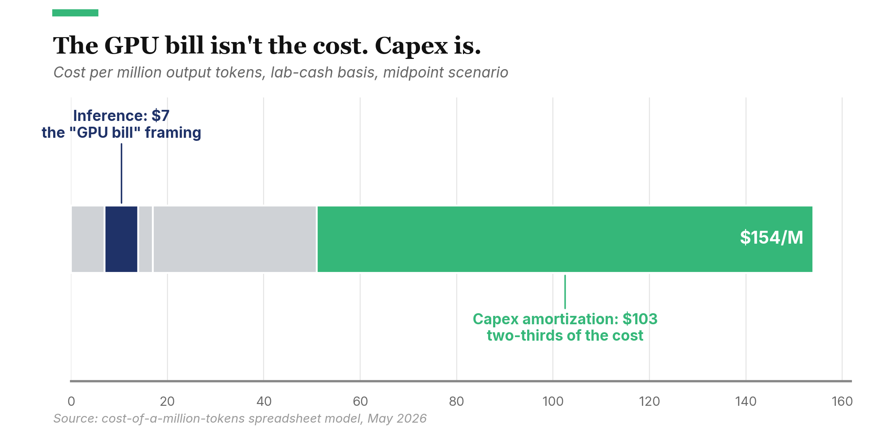

OpenAI projected a $5 billion loss for 2024 on $3.7 billion in revenue per September 2024 reporting,[^1] and projects $44 billion in cumulative losses before turning profitable in 2029.[^2] The industry's five-year capex commitments run to hundreds of billions. The public debate has split into "this is unsustainable" and "this works out fine," both confidently asserted.

A more useful question: what demand picture is today's spending pricing in? Compute the cost per million output tokens, ask what revenue that cost requires, and the $200 billion commitments stop looking insane and start looking like a bet on a specific scenario.

Two cost figures answer different questions. On a lab cash basis (what labs spend out of pocket), a million output tokens at midpoint costs $154. That's the number behind today's headline losses. On a full economic basis (which includes the capex hyperscaler partners bear through pass-through pricing), it's $253. That's the number the $200 billion commitments need to cover.

So who's right? If demand compounds enough to cover the full-economic basis (the spending implies the industry needs roughly twice today's tokens), all three frontier labs work. If demand stalls, the third lab exits frontier-class economics, though under the FTC/DOJ posture in the 2023 Merger Guidelines and the FTC's January 2025 6(b) report on CSP-AI partnerships, lab-on-lab M&A would not clear review. The realistic exit paths are wind-down, asset sale to a non-AI strategic, talent-and-IP acqui-hire, or absorption by a CSP under a non-controlling structure. Those paths disperse the revenue pool rather than re-pooling it to the survivors, so the survivor margins in Scenario B end up smaller than a "two labs absorb the third" story would imply. Bulls and bears are arguing about which scenario, not whether the spending could ever be earned back.

The cost stack helps locate where each lab stands. Inference compute is small, under $10 per million output tokens, well below what the popular "the GPU bill is the cost" framing suggests. The flat-rate consumer subscription is where the subsidy concentrates, while API and enterprise contracts fund the rest of the business. Three deals last month shifted which frontier lab is most cost-exposed, and not the obvious candidate. The numbers come from a [spreadsheet model](#) with editable inputs across low, mid, and high scenarios; I'd update most of these conclusions if the key inputs turned out to be off by a lot.

## The cost stack: five layers, one dominates.

A frontier AI lab's cost per million output tokens decomposes into five layers.

The first is **training amortization**. A frontier training run costs between $100 million and $1.5 billion and produces a model with a useful life of twelve to twenty-four months before it is superseded. The Information reported that training compute alone cost OpenAI roughly $3 billion in 2024.[^3] Spread across the tokens the lab serves over that life, training contributes about $7 per million output tokens at midpoint.

The second is **inference compute**. This is the GPU time required to generate tokens, weighted by the lab's effective cost per GPU-hour and its throughput. The Information put OpenAI's 2024 inference spend at roughly $2 billion.[^3] At midpoint, this layer comes to about $7 per million output tokens. A few dollars goes to output compute and a few more to input tokens, given typical input:output ratios. I'd assumed the GPU bill would dominate before running the numbers; it doesn't.

The third is **infrastructure overhead**: power, cooling, networking, redundancy, datacenter real estate. These scale with compute and contribute about $3 per million output tokens at midpoint, the smallest of the five layers.

The fourth is **R&D, people, and data**: researcher salaries, safety teams, RLHF labor, data acquisition and licensing. OpenAI alone spent over $700 million on salaries in 2024 before stock-based compensation.[^3] Major labs spend $1 billion to $3 billion annually in this category. Amortized across tokens served, this layer runs about $36 per million output tokens at midpoint.

The fifth and largest is **capex amortization**. Datacenter buildouts run $30 million to $50 million per megawatt for AI-optimized facilities, a range consistent with what JLL, CBRE, and Cushman publish for grid-connected liquid-cooled builds. Behind-the-meter projects (the ones routing around multi-year interconnection queues) are at the high end or above, because the on-site generation is folded into the per-MW figure. Power-side interconnection and on-site generation can add 10-20% on top of that depending on how the project is structured. GPU systems cost $30,000 to $80,000 per GPU-equivalent (normalized to FP8 throughput) on a fully-deployed basis, cards plus networking, interconnect, and supporting infrastructure, depreciating over three to five years. The low end is closer to H100-class with shared interconnect; the high end is closer to GB200 NVL72 system pricing. A frontier lab's total capex commitment can reach $40 billion undepreciated. Spread that across annual token volumes and you get $103 per million output tokens at midpoint. That's larger than every other layer combined: roughly two-thirds of the lab's cash cost per token ($103 of $154), or roughly 40% of the full-economic basis ($103 of $253). Capex dominates either way.

Add the layers together (allowing for light rounding) and the midpoint cost per million output tokens comes to $154 on a lab cash basis, or $253 on a full economic basis. The two bases answer different questions. Lab cash is what the labs spend out of pocket, the basis behind OpenAI's $5 billion loss. Full economic includes the capex hyperscaler partners bear through pass-through pricing, the basis the $200 billion compute commitments need to cover. The rest of the article uses both, where each is the right one.

For scale: the $200 billion Anthropic commitment is Greece's annual GDP, $253 billion in 2024.[^15] The Apollo program in 2024 dollars: $260 billion.[^16] The four-hyperscaler RPO total of $1.7 trillion is Spain's GDP.[^17] The Big Four spent $251 billion combined on capex in 2024.[^18] Two years of that covers the entire AI-attributed backlog.

## Who's subsidizing whom?

The decomposition sharpens that subsidy claim. People saying "AI is being subsidized" are pointing at something real, but the subsidy isn't spread evenly across users.

For each individual API query, frontier pricing of $15 to $75 per million output tokens easily covers what it costs to generate that query (inference plus infrastructure). The price runs well above the direct cost, so the WeWork comparison doesn't hold up here. Add training, R&D, and capex and at full cost the consumer flat-rate subscription is the layer that loses money.

How underwater? At midpoint inputs, a $20-per-month subscription with 250 queries (the model's median consumer) loses about $3/month on lab cash and roughly $18 on full economic cost. Break-even is around 216 queries/month on cash, ~130 on full economic. The light-use consumer (under ~130 queries) is profitable; the median consumer is underwater on both bases, more so on full economic; the power user at 2,000 queries × 1,000-token outputs compounds the loss fast. Investors are subsidizing the consumer flat rate and the next training run. Enterprise and API usage, paying premium rates, fund the unsubsidized parts of the business.

This is also why every consumer-facing AI product has been adding usage caps and tiered pricing. Flat-rate pricing breaks down at heavy use. Usage caps and tiers are what that looks like in product.

## Could the labs just be profitable?

Two of three labs survive, not all three. The consolidation finding behind the rest of the analysis: at the full-economic basis, the addressable revenue pool sustains two frontier labs comfortably, three only if demand compounds the way the spending requires. If three labs each spend $5 billion to $10 billion annually on R&D and capex and the pool can sustain two of them, one winds down, sells its assets, gets acqui-hired, or settles into frontier-trailing status. Lab-on-lab whole-company M&A is the path that won't clear current FTC review; the realistic exits scatter the revenue rather than handing it to the survivors.

The survivor numbers look dramatic in isolation. Strip out training, R&D, and capex, and the remaining cost (inference plus operating infrastructure) drops to about $9 per million tokens at midpoint. Against consumer revenue yield of $133 per million tokens, that is a 93% gross margin. A lab in "harvest mode" would generate billions in free cash flow.

The trouble is that nobody can run that strategy unilaterally. The closest analogy is semiconductors or pharmaceuticals: TSMC's margins would surge if it stopped building new fabs, and the company would be obsolete in five years. The first frontier lab to stop investing watches competitors capture its enterprise contracts within a year or two. Frontier AI and the investment in it aren't separable. Strip out the investment and the business is gone in five years.

So harvest-mode math isn't an exit strategy. It's what consolidation enables for the survivors.

## Google's hand, before April

One of the three players, Google, has a structural cost advantage the other two can't easily match.

Google designs its own TPUs and avoids Nvidia's hardware margin. It has been operating at hyperscale longer than the other frontier-lab parents and owns its full datacenter stack end-to-end. It self-funds AI investment from a $260 billion-plus ad business. It distributes models to billions of users through Search, Workspace, and Android at zero acquisition cost. It owns decades of search and YouTube data.

Stack these and the model puts Google's cost per token around 70% to 75% of the standalone-lab baseline, on either basis. Roughly thirty percent lower, across every relevant layer. The biggest single driver is the TPU vs. Nvidia margin assumption. Drop that and the gap narrows fast.

That left OpenAI and Anthropic in a tight spot as standalones. The strategic options narrowed to three: outrun Google on capability and charge frontier-premium prices, fold into a hyperscaler's distribution and accept its silicon stack as the de facto cost basis, or diversify across multiple stacks to capture pieces of someone else's integration. The third option looked theoretical at the time.

That was the picture as recently as last month.

## Three deals in three weeks

Three recent announcements have reshaped this.

On April 24, 2026, Google announced an investment in Anthropic of up to $40 billion. The first $10 billion landed immediately at a $350 billion valuation; the remaining $30 billion is contingent on performance milestones.[^4] The deal includes 5 gigawatts of TPU capacity over five years.[^5] The Information later put Anthropic's total commitment to Google Cloud at roughly $200 billion over five years.[^6]

On April 20, Amazon expanded its existing Anthropic investment with up to an additional $25 billion alongside 5 gigawatts of Trainium capacity.[^7]

On May 6, 2026, Anthropic announced an agreement to take over the entirety of xAI's Colossus 1 datacenter in Memphis: 300 megawatts of capacity and over 220,000 Nvidia GPUs, predominantly H100 with newer Blackwell capacity per public reporting, available within the month.[^8] The capacity allowed Anthropic to immediately double Claude Code rate limits and remove peak-hour restrictions for Claude Pro and Max subscribers.[^8]

Anthropic now has roughly 10 gigawatts pledged across three silicon stacks with different toolchains: Trainium (Neuron SDK) from Amazon, TPUs (XLA) from Google, and Nvidia (CUDA) from xAI/SpaceX and other partners. Inference is portable across these. Training is not. Porting a tuned model across stacks takes anywhere from days to months of compiler and numerical-precision work. So a gigawatt of one is not a clean substitute for a gigawatt of another for a workload tuned to a specific stack. The company has gone from a single-stack proxy for Amazon to a multi-stack tenant; the strategic optionality is real, but smaller than the gigawatt totals alone make it look.

Two things follow.

The first: Anthropic's cost structure improves. TPU access passes some of Google's chip cost advantage to Anthropic. Industry reporting (VentureBeat, SemiAnalysis) puts the external-customer TPU savings at roughly 30% net of Google's and Broadcom's margins, well below the ~40-50% internal TCO advantage Google retains for itself. Google is selling a discount on its chip cost, not the full delta, and is monetizing the rest as cloud-segment margin. Multi-vendor sourcing reduces single-supplier markup on capex. In the model, Anthropic's cost per million tokens drops from $153 (essentially baseline) to $137, about 11% lower. Its gap to Google narrows from twenty-five percentage points to fifteen.

The second: Google's competitive position becomes more interesting. Selling TPU capacity to a competitor at scale is a strategic tradeoff under regulatory scrutiny that's already been formalized: the FTC's January 2025 6(b) report on CSP-AI partnerships flagged equity, control, and exclusivity provisions in deals like Microsoft-OpenAI and Amazon-Anthropic for switching-cost and input-foreclosure concerns. The Google-Anthropic deal's contingent-tranche structure ($10B cash up front, $30B contingent on undisclosed milestones) and non-exclusivity look engineered to stay below a de-facto-merger threshold the FTC would investigate. Within that constraint, Google gains cloud revenue and external validation of TPUs as a credible Nvidia alternative.

The scale of the commitments is itself notable, though the popular framing is misleading. The four-hyperscaler RPO total is roughly $1.63 trillion as of recent disclosures; recent commitments push that toward $2 trillion. The AI-attributed share is concentrated in roughly six contractual relationships: OpenAI's ≈$281B at Microsoft (about 45% of its $625B backlog) and ≈$300B at Oracle (Stargate, about 54% of its $455B RPO), plus Anthropic's $200B at Google Cloud (more than 40% of Google Cloud's backlog) and undisclosed terms at Amazon.[^6] That's not "half of $2T spread across the AI customer base." It's two customers driving almost all of the AI-attributed RPO. And RPO is a contractual artifact under ASC 606, not a cash line: milestone gates and termination-for-convenience clauses (exactly what's in the Google-Anthropic deal) qualify the recognized number without changing the headline. Selling TPU capacity to Anthropic narrows the cost-advantage gap in exchange for revenue and ecosystem effects.

What surprised me when I re-ran the post-deal numbers was OpenAI's cell. It barely shifted. OpenAI began renting Google Cloud TPUs in mid-2025 for ChatGPT inference[^12] (its first non-Nvidia silicon), and announced a 10-gigawatt custom-silicon partnership with Broadcom in October 2025: OpenAI-designed accelerators on TSMC 3nm, deployments running from H2 2026 through 2029.[^21] On paper that's three silicon ecosystems pledged at scale comparable to Anthropic's multi-stack 10 gigawatts. But TPU access is inference-only, and the Broadcom ramp falls outside the bull/bear window the model covers. Most of the cost-side benefit arrives in 2028 or later. Within the window the model examines, OpenAI is still the most cost-exposed of the three frontier labs. Optionality is coming. That's a position the company hasn't held before.

## What demand do the commitments price in?

Take the commitments at face value and back into what they assume. Anthropic's roughly $200 billion in Google Cloud spend over five years averages to $40 billion a year of compute. At the full-economic basis of $253 per million tokens, that's about 158 trillion output tokens a year Anthropic needs to serve to clear the cost of its own commitment. Run the same math on OpenAI's hyperscaler stack and you get roughly 237 trillion tokens a year. Across the three frontier labs and the broader market, total industry demand needs to land near 474 trillion tokens annually for the spending to make sense at full-economic cost.

The $200 billion is the headline maximum; the contingent equity tranches and parts of the compute commitment unlock on performance milestones. If demand stalls, the upper tranches don't trigger, the cash commitment falls well below the headline, and the supply-side overbuild risk partially self-corrects. The arithmetic below uses the headline.

For context, today's revenue mix only covers the full-economic cost of about 25 trillion tokens a year. The spending is pricing in something much bigger than what current revenue funds.

Comparing the post-deal capacity buildouts against estimated current industry token volume, the growth multiple the spending implies is about 1.9x. The industry needs to roughly double its served tokens.

What does 474 trillion tokens look like in users? At today's heavy-user intensity (about 25 million tokens a year, the consumer 95th percentile), the industry needs 19.8 million heavy users. At the consumer median (250 queries a month), 40 million paying seats at heavy-use-equivalent intensity. Globally, 19.8 million is New York State's population. 40 million is California's.

Hitting the implied user counts doesn't require normal office workers converting en masse. The seats number is conservative: a developer using Claude Code or Cursor burns millions of tokens a day, an order of magnitude above the consumer 95th percentile. The 1.7 million US developer workforce[^20] and the 47 million global developer pool[^19] are reference points for scale, not a claim that only developers will drive token consumption. Reach 40% of the global pool at heavy-use intensity and you have the 19.8 million heavy users the arithmetic requires; a US-developer-sized pool using AI the way a Claude Code user does today produces the same total.

That framing has a blind spot. Agentic usage doesn't stop at developers. Claude Code is the proof of concept that an agent burning tokens in a loop consumes one to two orders of magnitude more than chat, and the pattern is generalizing past coding: agents operating on inboxes, spreadsheets, browser sessions, multi-step research. A knowledge worker running an agent across a workflow burns tokens at Claude Code intensity without writing a line of code. The open question is whether non-developer agentic usage ends up consuming as many tokens as the heavy-developer cohort, or more. If it does, the heavy-user pool a few years out doesn't look like today's developer pool, and the implied doubling comes from a population the seat-count framing misses.

This is the demand picture the spending is pricing in: roughly a doubling of served tokens, distributed across an order of magnitude more heavy users than the labs currently serve. The bull case is that this is conservative because inference cost is falling fast for equivalent capability, which makes each new dollar of revenue serve more tokens. How fast depends on which mechanism you count. a16z's "LLMflation" measure puts the API-list-price decline for equivalent capability at roughly 10x a year, but that blends algorithmic efficiency, hardware improvements, and competitive margin compression. Epoch AI's work on algorithmic efficiency alone puts that durable component closer to 3x a year. The bear case is that compute capacity scales linearly while users don't, that 40 million paying seats is several years of growth even at industry-leading rates, and that the bull case depends on margin compression continuing indefinitely on top of the algorithmic gains.

## The run rate looks healthy. The supply side doesn't.

Anthropic disclosed in April that its annualized run rate had reached $30 billion, more than triple where the company stood at the end of 2025.[^9] (Anthropic reports revenue gross of cloud reseller pass-throughs, which inflates the figure relative to net-reporting peers; the directional growth is what matters here.) If that growth holds, demand is compounding fast enough to absorb the capex commitments. The bear case has weakened.

Two things keep it alive. xAI built Colossus 1 to train Grok, then migrated training workloads to the larger Colossus 2 facility, leaving Colossus 1 with idle capacity that needed a tenant.[^10] Purpose-built capacity is outrunning native demand even at AI-native operators. Some "overbuild" risk is real, even if Anthropic's specific demand looks healthy.

The second fragility is on the supply side, invisible to the cost model. Utility transformer lead times are running three to five years; U.S. grid interconnection queues stretch years; AI-grade datacenter power is in short supply, and capex alone won't fix it. Anthropic's CEO cited "difficulties with compute" as the gating factor on quarterly growth.[^13] If gigawatts pledged on paper cannot be delivered on schedule, the demand-side question (will revenue keep compounding) and the supply-side question (can the gigawatts arrive in time) compound each other. The cost model captures the first, not the second.

## Where does that leave the three labs?

Two scenarios.

**Scenario A: demand compounds.** Anthropic's run rate keeps tripling, industry token volume crosses the 1.9x growth multiple, the price-yield gap narrows as inference cost falls. All three labs find profitable scale.

**Scenario B: demand stalls.** Token growth lags the spending. The third lab exits frontier economics via wind-down, asset sale, acqui-hire, or non-controlling CSP absorption, not whole-company M&A, which won't clear the FTC. Two labs hold frontier-class economics; the third gets restructured or settles into frontier-trailing status. The revenue doesn't necessarily re-pool to the survivors the way the "two absorb the third" picture suggests.

Google is the safest in either scenario: structural cost advantage at 70% to 75% of the standalone-lab baseline, self-funded from a $260 billion-plus ad business, lowest customer-acquisition cost in the industry. Among Anthropic and OpenAI, the post-April model puts OpenAI as the most exposed in Scenario B. Anthropic has 10 gigawatts pledged across three silicon stacks at $137 per million tokens lab cash. OpenAI has a comparable 10-gigawatt program in flight: Nvidia today, TPU for inference, Broadcom custom silicon ramping into the late-2020s. The Broadcom volume arrives mostly after the window the model covers.

Three diagnostic ratios are what I'd watch for which scenario plays out:

- **Training cost growth vs. revenue growth.** If revenue outpaces training spend, the model converges; if training spend outpaces revenue, it diverges. Shortest feedback loop of the three.
- **Enterprise revenue mix.** Heavy consumer users go negative at full-economic cost; enterprise pricing at $50 to $75 per million tokens leaves real gross margin against lab cash cost, though full economic erodes it. The higher the enterprise share, the more durable the business is to a demand stall.
- **Inference cost decline rate.** Inference cost decline blends algorithmic efficiency (Epoch puts this at ~3x a year), hardware improvements, and competitive margin compression (a16z's combined headline is ~10x a year for equivalent API capability).[^14] At the headline rate the 1.9x demand multiple holds; at the algorithmic-only rate it doesn't. The bull case depends on margin compression continuing alongside the durable algorithmic component.

For frontier labs as a category, the model leans sustainable, with meaningful turbulence on the way. As of May 2026, both scenarios look reasonable, each on conditions the diagnostic ratios above can check. The bull case requires the doubling. The bear case requires the doubling to slip and one lab to absorb the consolidation.

For Google, I don't know whether monetizing the cost advantage will prove smart or a slow erosion of moat. That one settles on a multi-year timescale and the model can't help much.

For OpenAI, the question is sharper. Can scale and consumer distribution outrun a worsening relative cost position? The model says Scenario B doesn't go well for them; they'd argue the consumer distribution and scale advantages aren't priced into the cost-side analysis. Both are reasonable readings.

## Diversifying away from Microsoft requires more Microsoft

In early May, The Information reported that OpenAI's Broadcom custom-silicon deal had hit an $18 billion financing snag.[^22] Broadcom had originally asked OpenAI to match its capital one-for-one. Broadcom has since relaxed that demand. The new condition: Microsoft commits to buying roughly 40% of the chip output, or OpenAI finds substitute customers for that share.

OpenAI's path to silicon diversification (the move that would reduce its cost exposure relative to Anthropic) requires capital OpenAI doesn't have alone. The deal that diversifies away from Microsoft requires deepening dependence on Microsoft. The diagnostic ratio to watch: can OpenAI fund the Broadcom ramp through non-Microsoft revenue and outside capital, or does dependence on Microsoft prove unavoidable?

## The doubling looks fantastical until you count tokens per user

The cost numbers add up. The bull/bear argument is about demand, not cost.

And the demand picture is both things at once. Industry tokens need to roughly double, distributed across an order of magnitude more heavy users than the labs currently serve. Stated that way, the requirement is a stretch.

Stated differently, you don't need to convert one new user. Existing users just need to keep burning more tokens per interaction, which they do naturally as agentic patterns spread and multimodal inputs become routine. Each product release pulls users into higher-intensity workflows: from chat, to chat with tool calls, to agent loops, to long-running agents that run in the background. A screenshot pasted into chat encodes to roughly 1,500 input tokens; a minute of video, on the order of 100,000. Token consumption per active user isn't fixed. It's elastic, and the trend is up.

The 1.9x looks crazy at the seat-count level and routine at the per-user intensity level. The question for the demand side isn't whether tens of millions of new heavy users sign up. It's whether the existing ones keep finding more to do with the tools. Am I going crazy?

---

*The model behind this analysis is available as a [spreadsheet with editable inputs](#).*

---

## Sources

[^1]: Goswami, Rohan. "OpenAI sees roughly $5 billion loss this year on $3.7 billion in revenue." CNBC, September 27, 2024. https://www.cnbc.com/2024/09/27/openai-sees-5-billion-loss-this-year-on-3point7-billion-in-revenue.html

[^2]: TapTwice Digital. "8 OpenAI Statistics (2025): Revenue, Valuation, Profit, Funding." May 2025. https://taptwicedigital.com/stats/openai

[^3]: The Information, October 2024 (paywalled), reporting OpenAI's 2024 cost breakdown for training, inference, and salaries. Independent corroboration: Data Center Dynamics, "OpenAI training and inference costs could reach $7bn for 2024." https://www.datacenterdynamics.com/en/news/openai-training-and-inference-costs-could-reach-7bn-for-2024-ai-startup-set-to-lose-5bn-report/

[^4]: Bloomberg. "Google Plans to Invest Up to $40 Billion in Anthropic." April 24, 2026. https://www.bloomberg.com/news/articles/2026-04-24/google-plans-to-invest-up-to-40-billion-in-anthropic

[^5]: PYMNTS. "Google Doubles Down on Anthropic With New $40 Billion Investment." April 24, 2026. https://www.pymnts.com/news/investment-tracker/2026/google-doubles-down-on-anthropic-with-new-40-billion-investment/

[^6]: Let's Data Science. "Anthropic Just Promised Google $200 Billion. That's Five Times What Google Is Paying Anthropic." May 5, 2026. Citing The Information. https://letsdatascience.com/blog/anthropic-200-billion-google-cloud-five-year-commitment-may-5

[^7]: Tech Insider. "Google's $40B Anthropic Investment: TPU Deal Inside [2026]." April 24, 2026. https://tech-insider.org/google-40-billion-anthropic-investment-tpu-compute-2026/

[^8]: Anthropic. "Higher usage limits for Claude and a compute deal with SpaceX." May 6, 2026. https://www.anthropic.com/news/higher-limits-spacex

[^9]: Sun, Billy. "Google Is Getting a Screaming Bargain on Its New Anthropic Investment. Here's Why." The Motley Fool, April 27, 2026. https://www.fool.com/investing/2026/04/27/google-screaming-bargain-anthropic-investment/

[^10]: Crolly, Mathieu. "Anthropic strikes compute deal with SpaceX—what it means for the future of AI." DEV Community, May 7, 2026. https://dev.to/mcrolly/anthropic-strikes-compute-deal-with-spacex-what-it-means-for-the-future-of-ai-1moj

[^12]: Reuters, The Information, and others reporting OpenAI's first use of Google Cloud TPUs for ChatGPT inference (mid-2025); see Data Center Dynamics, "OpenAI to use Google's TPUs (report)." https://www.datacenterdynamics.com/en/news/openai-to-use-googles-tpus-report/. CNBC's November 2025 piece on Google's TPU strategy explicitly identifies OpenAI as a customer.

[^13]: Field, Hayden. "Anthropic CEO Dario Amodei says company grew 80-fold in first quarter." CNBC, May 6, 2026. https://www.cnbc.com/2026/05/06/anthropic-ceo-dario-amodei-says-company-crew-80-fold-in-first-quarter.html

[^14]: Inference cost-decline estimates vary by methodology and benchmark. See Epoch AI's compute-efficiency analyses and a16z's cost-of-LLM analyses; the supporting spreadsheet model assumes ~10x/year for comparable capability, consistent with the high end of cited industry estimates.

[^15]: International Monetary Fund. World Economic Outlook (October 2025), Greece country profile. https://www.imf.org/external/datamapper/profile/GRC

[^16]: The Planetary Society. "How much did the Apollo program cost?" https://www.planetary.org/space-policy/cost-of-apollo

[^17]: World Bank. "GDP (current US$) - Spain." 2024 data. https://data.worldbank.org/indicator/NY.GDP.MKTP.CD?locations=ES

[^18]: Statista. "Big Tech's AI Spending to Reach $725 Billion in 2026." Combined capex of Meta, Alphabet, Amazon, and Microsoft. https://www.statista.com/chart/35046/capital-expenditure-of-meta-alphabet-amazon-and-microsoft/

[^19]: SlashData. "Global developer population trends 2025: 47.2 million developers worldwide." https://www.slashdata.co/post/global-developer-population-trends-2025-how-many-developers-are-there

[^20]: U.S. Bureau of Labor Statistics. "Software Developers, Quality Assurance Analysts, and Testers: Occupational Outlook Handbook." 2024 employment data. https://www.bls.gov/ooh/computer-and-information-technology/software-developers.htm

[^21]: OpenAI. "OpenAI and Broadcom announce strategic collaboration to deploy 10 gigawatts of OpenAI-designed AI accelerators." October 13, 2025. https://openai.com/index/openai-and-broadcom-announce-strategic-collaboration/

[^22]: The Information. "OpenAI's AI Chip Deal With Broadcom Hits $18 Billion Financing Snag." May 8, 2026. https://www.theinformation.com/articles/openais-ai-chip-deal-broadcom-hits-18-billion-financing-snag. Also covered by Winbuzzer, May 8, 2026: https://winbuzzer.com/2026/05/08/openais-ai-chip-deal-with-broadcom-hits-18-billion-xcxwbn/
