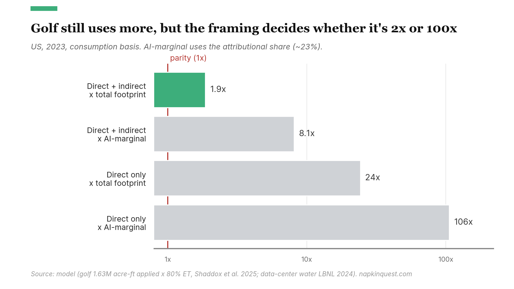
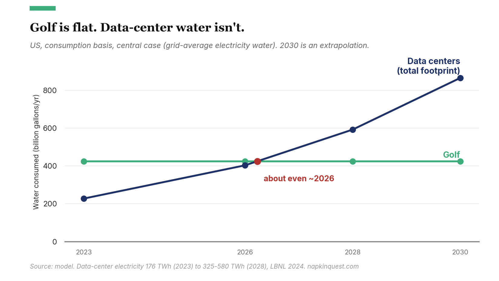
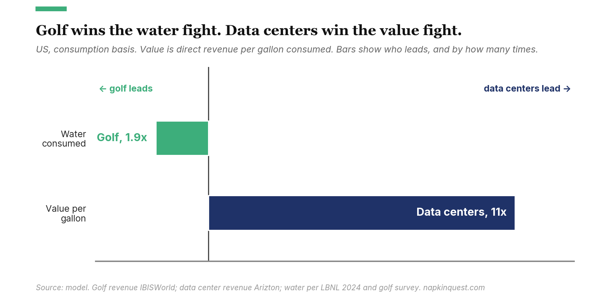

My second son raised a claim that has been making the rounds in defense of the AI buildout: golf courses use far more water than data centers, so the outrage about server farms draining the reservoirs is misplaced. Both golf and AI are things a society could choose to do without, which makes them fair to weigh against each other in a way that comparing data centers to farms is not.

Using the back of a napkin, golf does use more water than data centers today, by somewhere between 2 times and 100 times. Which number you get depends on two choices: whether you count the water used to make the electricity, and your time horizon. Get to 2028 on the central assumptions and the comparison flips.

## Why not compare AI to farming?

US agriculture consumes something like 73 billion gallons of water a day through irrigation, per the USGS. That is roughly 27 trillion gallons a year. Golf and data centers together are a rounding error against it. So why not compare AI to farming?

Golf and AI are both discretionary. You can argue about how discretionary AI is, but nobody starves if a hyperscaler delays a training run, and nobody starves if a fairway goes brown.

Everything below is United States, national, and annual. The figures are consumption, not withdrawal: water that evaporates or transpires and never returns to the source, rather than water that is borrowed and largely given back. Holding both sides to consumption is the choice that moves the answer most.

## "A golf club uses more water than ChatGPT"

The viral form is blunt. "A single golf club uses more water than ChatGPT." Analyst write-ups and local-news explainers run the same play: golf in the United States uses on the order of 1.5 to 2 billion gallons a day, data centers use about 17 billion gallons a year, so golf wins by many multiples. One widely shared Arizona analysis put Maricopa County golf at roughly 30 times the water of the county's data centers and concluded the server farms are not the villains.

The figures these pieces cite are real. Golf's applied irrigation water for 2024 was 1.63 million acre-feet, per the GCSAA and USGA's environmental survey (the fourth round, published in 2025). Data centers' direct on-site water consumption for 2023 was about 17 billion gallons, per Lawrence Berkeley National Laboratory's December 2024 report. Side by side, golf is roughly 24 times larger.

But those two numbers are not apples to apples.

## Three ways the comparison goes wrong

In increasing order of impact:

### Golf's number is water borrowed; the data center number is water gone

Golf's 1.63 million acre-feet is *applied* water, the amount sprayed on the turf. A good chunk of that soaks back into the ground or runs off and returns to the source. The portion actually consumed, lost to evaporation and transpiration, is lower. How much lower is unknown. No survey measures it. The turf-irrigation literature supports something in the range of 70 to 90 percent consumed, so I modeled it as a low/central/high band and labeled it for what it is, an assumption rather than a measurement.

At the central 80 percent, golf's 1.63 million acre-feet of applied water (531 billion gallons) becomes about 425 billion gallons consumed. Across the 70-to-90 band, golf falls between 360 and 493 billion gallons. So this correction shaves golf down by a tenth to a third.

### The data center number leaves out the thirstiest part

The 17 billion gallons is only the water that evaporates inside the building, in the cooling towers. It ignores the water consumed at the power plants making the electricity the servers run on. LBNL puts that indirect figure at about 210 billion gallons for 2023, more than twelve times the on-site number. Counting it takes total data center water consumption to roughly 228 billion gallons.

That single addition closes most of the gap. Against data centers' direct water alone, golf consumes about 24 times more. Against the full footprint including the electricity, golf consumes about 1.9 times more. The gap goes from "not a contest" to "roughly double."

But that 210 billion gallons is a high estimate. LBNL uses a grid-average water intensity of 4.52 liters per kilowatt-hour, which includes evaporation off hydropower reservoirs and averages across the whole grid. New data center load does not draw on the average grid. It draws on new gas plants and renewables, which consume far less, closer to 0.8 liters per kilowatt-hour. Swap in that marginal figure and indirect water roughly quarters, the widest single variable in the model. The central case keeps LBNL's published number; flip to the marginal view and the gap to golf widens back out.

### The national number hides where the water actually is

Both uses are national aggregates. Golf is spread across roughly 14,000 facilities. Data center water clusters in a handful of metros, several of them already short on water.

Maricopa County, Arizona is the test case, because it is dense in both. Even there, golf wins on totals: Phoenix-area golf runs near 99,500 acre-feet a year against a few thousand acre-feet for the state's operating data centers, a gap of around 35 times. The national result survives at the county level.

It does not survive at the level of a single address. An average Phoenix golf course consumes about 504 acre-feet a year. Meta's Mesa campus, at full build-out, is planned for about 1,400 acre-feet. That is the water of nearly three golf courses, concentrated at one site and drawing from one local supply. Golf is more water spread thin. A hyperscale campus is less water concentrated to a point. If your worry is a regional aquifer, watch the campus drawing from it, not the national total.

## Golf leads now, but the gap is closing

Golf still uses more water than data centers today. That much holds up under every framing in the model. But "how much more" ranges across the four cells from about 1.9 times to about 106 times, and a fair version of the claim has to say which cell it is standing in.

| Data center framing | Water consumed, B gal/yr | Golf to data center |
|---|---|---|
| Direct only, all data centers | 17 | 24x |
| Direct only, AI's share | 4 | 106x |
| Direct + indirect, all data centers | 228 | 1.9x |
| Direct + indirect, AI's share | 52 | 8x |
| Golf (consumed) | 425 | reference |

The popular comparison lives in the top-left cell, golf against on-site data center water, where the ratio is largest. The most complete comparison, total footprint against total footprint, is the row where golf leads by less than two to one. If you narrow to the slice of data center water that is specifically AI rather than ordinary cloud computing, golf pulls ahead again, by roughly 8 times on the attributional method, more if you measure AI's share another way. AI's share is itself uncertain. It increasingly runs on the same shared infrastructure as everything else, so there is no clean line around it. The model offers three ways to draw the line and they disagree.

What does not survive is the idea that the comparison is stable. Golf's water is flat and slightly declining; the survey has it down 3 percent since 2020. Data center water is compounding at something like 20 percent a year as the buildout runs. So the gap is a moving target. On the central assumptions, total data center water consumption passes golf around 2026, about now, and reaches roughly 590 billion gallons by 2028 against golf's flat 425. What flips the comparison is not how you measure golf or how you define AI. It is time.

The crossover rides on the indirect-water intensity, where the model is least sure of itself. Hold to LBNL's grid-average number and the lines cross before 2028. Use the marginal gas-and-renewables figure instead and golf keeps its lead past 2030. Both are defensible. The reasonable conclusion is not a date but a direction: a comparison that currently favors golf is being pushed toward parity every year, and the speed depends on how the grid that powers the servers gets built.

## Per gallon, the value runs the other way

Water is only one side of the ledger. The other is what the water buys, and there the comparison inverts. Golf's courses take in about $35.7 billion a year in direct revenue (IBISWorld), which against 425 billion gallons is roughly 8 cents per gallon consumed. US data centers earn around $208 billion (Arizton) on 228 billion gallons, about 92 cents a gallon, eleven times golf's water productivity. Golf wins the gallons fight by nearly two to one. On value per gallon it loses by far more.

Put it as a breakeven. To match golf's revenue per gallon, US data centers would need to produce about $19 billion a year. They produce more than ten times that. Even AI on its own, the contested slice, would need about $4.4 billion against its roughly 52 billion gallons, and S&P Global puts US generative-AI revenue near $13 billion. Two caveats: value per gallon rewards whatever is not water-hungry, and turf is the thirstiest dollar in this comparison. And revenue misses both the recreation a course provides and the productivity AI only promises. The broad economic-impact totals (golf at $102 billion, data centers at $727 billion) point the same way but lean on industry-commissioned multipliers, so the narrower revenue is the safer figure.

Neither side is the water villain. Against agriculture, both are trivial: golf's 425 billion gallons is about 1.6 percent of what US irrigation consumes. "Golf uses way more water than data centers" is true, but only inside a specific and increasingly dated framing.

*Every figure here comes from a spreadsheet model. Change one assumption, the AI method, the projection year, the golf consumption fraction, or the electricity water intensity, and the four cells move with you.*
