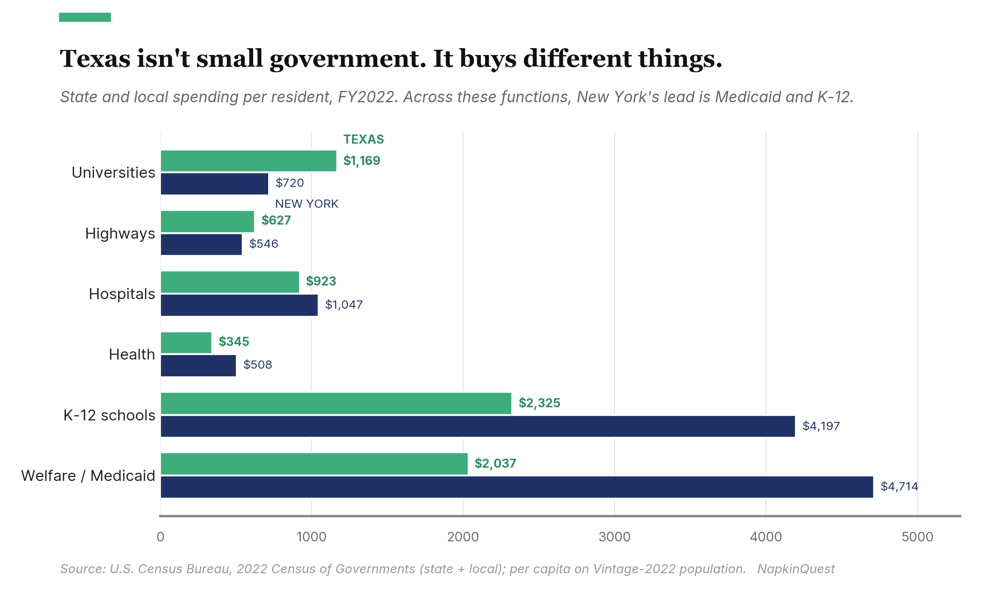

I recently had an interesting conversation about Zohran Mamdani with a friend from Texas. Zohran Mamdani was sworn in as mayor that January[^1], and the word going around about him wasn't "liberal," or even "socialist." It was "communist." The President got there first, posting that Mamdani was a "100% Communist Lunatic" the night he won the primary[^3]. And it wasn't only him, New Yorkers I think of as reasonable are uneasy too.

So I tried to pin down what Mamdani is doing that regular American government doesn't already do somewhere, using Texas as a foil. My suspicion is that policies are so vulnerable to labeling now that the substance is lost; that day-to-day governance is far more similar than different. A rent freeze is a price control, and Texas controls plenty of prices. Subsidized childcare is a transfer, and Texas transfers money all the time. The scariest item on the list, the city-run grocery store, turns out to be relatively tame once you look at how it's built. Texas runs bigger, more fully public versions of similar things, just without the name-calling or controversy.

If a city-owned grocery store is socialism, or even communism, then what do you call the county-owned, county-run, tax-funded hospital? In both cases, the government owns and offers something the market struggles to provide. Transfers are the name of the game. 

And to be clear, this is not a defense of Mamdani. It is a critique of the breathlessness surrounding political discourse and labeling.

## Is he a Communist?

Communism means no private property, with the means of production owned collectively. Mamdani's program keeps private property, private companies, private jobs, markets, and profit just about everywhere. Even the grocery store, the part that sounds most like the state taking over, is run by a private operator who hires the staff[^5]. This is not communism, by definition.

Socialist, the word Mamdani uses for himself[^2], is squishy. Again, the grocery store is where it almost applies: the city provides the land, pays to build, skips the rent, skips the property tax, and holds down the price of staples[^4]. So there is a legitimate public ownership component. But it's a public shell around a private engine, because a private grocer runs the store and hires the workers under rules the city sets[^5]. The money is supposed to come from redirecting an existing program called FRESH, and critics, including the city's own development corporation, say FRESH is mostly private money grocers put in for tax breaks, not city cash sitting around to move. One economist called the whole plan an accounting error[^6]. The City Council hasn't approved it, might not, and the first store isn't expected before late 2027[^7].

Social democrat is the fair description of most of his program: the rent freeze, the cheaper fares, the childcare help. Money moves around inside a capitalist economy, private ownership left alone. The separate Future Fund, an $80 million pot that lends to small businesses through community lenders at soft rates[^8], is basically a city development bank. Public money lent to private borrowers is a well-trodden road; there's nothing socialist about it.

And then there's plain old subsidy and provision, which is what all of it comes down to once you stop arguing about labels. Government pushes money, and sometimes goods, toward things the market struggles to provide, using tools common to every state.

## Rent-free is not free

A city store that pays no rent and no property tax still costs the public real money. The city pays to build it and keeps paying to hold the prices down, and a thin-margin grocery that underprices its staples on purpose never earns that back. The free rent and the skipped taxes are a cost too: whatever a private store on that lot would have produced. Add it up and the cheap pasta is bought with a public subsidy, the same kind as any other.

Whether that subsidy is wise is a fair question. But is it stranger than what other governments already support?

## The same instruments in a different context

Not everything is a subsidy, but for each thing New York proposes, Texas is already doing.

**Grocery store vs. county hospital.** Dallas County owns Parkland; Tarrant County owns JPS. Not contracts with private companies, actual ownership. The county owns the hospital, runs it, staffs it with public employees, and pays for it with a property tax the district charges every homeowner in the county[^11]. The hospital exists to serve the patients the market won't, the ones who can't pay. State law sets only a low minimum for indigent care[^12]; Dallas and Tarrant voters went well past it, creating hospital districts and taxing themselves to run full public hospitals. The grocery store is public ownership wrapped around a private operator and private staff, and it isn't even approved yet. The hospital is public ownership, public operation, public staff, and it has been running for decades. The more completely public thing is the one in red Texas, and everybody just calls it the county hospital. The less public one is in New York, and it gets the communist label.

The grocery store might genuinely be the worse idea of the two. It remains to be seen whether these stores will disrupt a functioning market or serve and underserved community. But it is undeniable that both ideas require subsidies to exist.

**Price subsidy vs. tax break.** Mamdani holds down the price of groceries. Texas holds down the cost of building a chip plant or a gas facility by capping the property taxes it will pay, first under Chapter 313 and now under its replacement, the 2023 JETI Act, where a company, a school district, and the Governor's office agree to freeze a project's taxable value for ten years[^14]. Under Chapter 313 the school district that signed the deal was reimbursed by the state, so the cost dispersed into the statewide budget. Grocery subsidies are called overreach while tax breaks are called economic development. Farmland gets the same treatment: Texas taxes it on what it grows, not what it is worth[^17].

**Future Fund vs. Enterprise Fund.** New York lends public money to private businesses through middlemen. Texas hands it to them, through the Texas Enterprise Fund, a cash deal-closing grant the Governor uses to pull projects in from other states[^15], and through hundreds of local development corporations funded by their own voter-approved sales taxes[^16]. Public money going to private companies either way. Neither one is socialism.

**Redistribution vs. recapture.** Take the affordability talk out of Mamdani's program and what's left moves money from people with more to people with less. Texas does that by law, and has for thirty years. Recapture, the thing everyone calls Robin Hood, pulls property-tax money out of rich school districts and sends it to the state, which folds it into the statewide school-funding pot. It is less a direct handoff from rich district to poor than a tax on wealthy localities to cover a statewide bill, but it is redistribution all the same. It runs to about $2.7 billion a year[^9]; the $5 billion figure still in circulation is a 2023 peak that recent property-tax cuts roughly halved. Describe it plainly, money taken from property-rich places and given to property-poor ones, and it is redistribution by another name.

If you step back from the four programs to the whole budget, New York spends more per resident than Texas, $17,437 to $10,186[^20], and it spends more on most things; it is a high-spend state. But the biggest single driver of the gap, about two-thirds of it, is two lines: Medicaid and K-12, where a budget's redistribution concentrates. New York does much more of both.

But the larger point is they both redistribute. Texas still spends $2,037 a head on welfare and Medicaid and $2,325 on schools, runs recapture on top, and outspends New York outright on universities and highways. The 'free-market' state runs a large redistributive government. It just runs a smaller one.

And smaller does not mean the smaller budget covers everything, at least where the need is inelastic. Texas leaves 16.7% of its residents uninsured against New York's 5%[^21], but those people still get sick and still show up at the ER and at the county hospital. The care is still delivered; what changes is who pays. Instead of the state covering them through Medicaid, the cost falls to the hospital district's property taxpayers, to the premiums of everyone insured, and to the patients themselves. Parkland and JPS are, in part, where the people Texas declined to cover end up: the county hospital is the gap-filler. This is cleaner for healthcare than for schools. An underfunded school is mostly just underfunded, a gap that surfaces in outcomes years later rather than on anyone else's budget. But on the biggest line, lower public spending mostly relocates the cost. It doesn't erase it.

## The fight is over the rate

In Tarrant County, a Republican commissioners court cut the JPS rate three years running, 19.45 cents per $100 in 2023, 18.25 in 2024, 16.50 in 2025[^13]. The 2025 cut got ugly: two commissioners broke quorum to stall it, and it passed only once one came back[^13]. The judge who pushed the cuts, Tim O'Hare, was explicit that he wasn't against the hospital: "You can be pro JPS, and pro indigent care and pro Level One trauma center, and also be fiscally responsible"[^13].

You could read three years of cuts as a slow kill: shave the rate until the place withers, and never cast the vote to close it. But JPS isn't withering. The commissioners cut the rate because the hospital kept running surpluses, hundreds of millions more than it budgeted, one year projecting $109 million in net income and booking $336 million[^18]. Through the same years, JPS broke ground on a $1.5 billion hospital and pushed its capacity from 582 beds to more than 740, an expansion voters launched with an $800 million bond, 82% in favor[^19]. You do not break ground on a billion-dollar hospital you are trying to strangle. The rate keeps falling and the hospital keeps growing, because a smaller rate on faster-rising property values still collects more money.

Parkland is the quieter version. After cutting its rate every year since 2019, the district held it flat for the first time in FY2026, and revenue still rose about 6% as valuations climbed[^11]. A leaner rate, a bigger budget.

Whatever an individual conservative privately wants, the system they run keeps funding and expanding these hospitals, and recapture tells the same story: repeal bills get filed and die, while the real fights are over the formula, not whether to redistribute at all[^10].

## How to split the check?

There are three ways a group settles the check after dinner.

Split it evenly, the same amount per head. Fast, until the person who came for a bowl of soup is handed the same bill as the one who ordered the steak. The first time someone can't cover an equal share, the table covers him, and the even split has quietly become split-by-who-can-pay. It doesn't survive its first broke diner.

Itemize, everyone pays for what they ordered. At a dinner, that mostly works, because a restaurant is all private goods: your plate is yours, and whoever can't pay simply doesn't get one. A country isn't a restaurant. It's full of the things no menu has: people who can't pay, an emergency room staffed for whoever walks in, clean water that can't be billed by the glass. None of it has a business model, so the market won't touch it, and the government pays for what's left.

What's left is the third rule: the leftover gets split by who can pay. Not because a table votes for it on principle, but because the even split is unfair and the menu doesn't cover everything. Every real "table" does both at once: you itemize what you can (you got the bottle, that's yours) and let whoever can carry the rest carry it.

So the fight was never about whether to split by ability, only how much. Texas does it and keeps quiet about it; New York does more and argues in public, with a self-described socialist running the city. But as far as I can tell, New York is less liberal than its opponents claim, and Texas is less conservative than it sells itself. So, may God bless long suffering Knicks fans and put them out of their misery.

## Sources

[^1]: Mayor's Office of the City of New York. "Mayor Zohran Mamdani Inaugural Address." nyc.gov, January 1, 2026. https://www.nyc.gov/mayors-office/news/2026/01/mayor-zohran-mamdani-inaugural-address ; THE CITY, "Mamdani Inauguration," January 1, 2026, https://www.thecity.nyc/2026/01/01/zohran-mamdani-inauguration-nyc/

[^2]: CNN. "Mamdani and democratic socialism, explained." November 6, 2025. https://www.cnn.com/2025/11/06/politics/mamdani-democratic-socialism-explained ; Washington Post, "What Mamdani means by democratic socialism," July 1, 2025, https://www.washingtonpost.com/politics/2025/07/01/zohran-mamdani-democratic-socialism-meaning-nyc/

[^3]: CNBC. "Trump calls New York's Zohran Mamdani a communist." June 27, 2025. https://www.cnbc.com/2025/06/27/trump-new-york-zohran-mamdani-communist.html ; TIME, "'Communist Lunatic,'" https://time.com/7297832/trump-zohran-mamdani-reaction-communist-lunatic/ . Trump publicly softened his tone after an Oval Office meeting on November 21, 2025 (Fortune, https://fortune.com/2025/11/21/trump-mamdani-meeting-says-civil-new-york-affordable/), so the "communist" charge was made but is not a fixed position.

[^4]: TIME. "What to know about Mamdani's city-owned grocery stores." May 21, 2026. https://time.com/article/2026/05/21/mamdani-city-owned-grocery-stores-east-harlem-manhattan-the-bronx/ ; amNY, "How Mamdani's city-run grocery plan would work," https://www.amny.com/news/how-mamdanis-city-run-grocery-plan-would-work/ . The original campaign pledged roughly $60 million for five stores; the administration's current capital request is about $70 million.

[^5]: amNY. "How Mamdani's city-run grocery plan would work." https://www.amny.com/news/how-mamdanis-city-run-grocery-plan-would-work/ . Stores are to be run by a private operator selected via RFP (process slated for summer 2026); the operator, not the city, employs the workers, and Mamdani declined to commit to unionized staff.

[^6]: American Enterprise Institute. "Mamdani's government grocery stores plan is based on an accounting error." https://www.aei.org/op-eds/mamdanis-government-grocery-stores-plan-is-based-on-an-accounting-error/ . The dispute: funding is to be redirected from the FRESH program, which critics (including NYC EDC) argue is mostly private grocer investment under tax/zoning incentives, not city cash available to move.

[^7]: THE CITY. "Mamdani's municipal grocery faces a basket full of challenges." April 23, 2026. https://www.thecity.nyc/2026/04/23/mamdanis-municipal-grocery-faces-basket-full-of-challenges/ . Requires City Council approval, which is not assured; first store expected no earlier than late 2027.

[^8]: Mayor's Office of the City of New York. "Mayor Mamdani Launches $80M NYC Future Fund." nyc.gov, March 17, 2026. https://www.nyc.gov/mayors-office/news/2026/03/mayor-mamdani-launches--80m-nyc-future-fund--expanding-affordabl ; Crain's New York Business, https://www.crainsnewyork.com/politics-policy/cny-mamdani-future-fund-business-loans-20260317/ . The fund lends through CDFIs (Community Reinvestment Fund USA, Accompany Capital, Grow America, Pursuit) at 7.5% with revenue-based repayment; it is distinct from the grocery initiative.

[^9]: Texas Education Agency, "Excess Local Revenue" and "Recapture Paid by District" (district-level totals, summed). https://tea.texas.gov/finance-and-grants/state-funding/excess-local-revenue ; Texas Education Code Chapter 49, https://statutes.capitol.texas.gov/Docs/ED/htm/ED.49.htm . Recapture is governed by Chapter 49 (the prior Chapter 41 was repealed by HB 3 in 2019). The most recent actual statewide total is about $2.68 billion (SY2024); the widely-cited ~$5 billion figure is the SY2023 peak (about $4.5 billion), roughly halved after the 2023 property-tax compression cut local M&O rates.

[^10]: WFAA. "Texas recapture / Robin Hood repeal bill (HB 620, 2023)." https://www.wfaa.com/article/news/education/texas-recapture-robin-hood-bill-repeal-house-bill-620/287-8811c5ac-b9df-45cb-bd8e-bd08838e4f54 . Repeal bills are filed periodically but do not pass; the substantive fights are over the formula and the basic allotment.

[^11]: Parkland Health (Dallas County Hospital District). "Board of Managers." https://www.parklandhealth.org/board-of-managers (board appointed by the Dallas County Commissioners Court, which approves the budget and tax rate). KERA News, "Parkland sets FY2026 tax rate," September 17, 2025, https://www.keranews.org/health-wellness/2025-09-17/parkland-health-tax-rate-budget-dallas-county (FY2026 rate $0.212000 per $100; the district reduced its rate every year from 2019 before holding it flat for FY2026, when property-tax revenue still rose about 6% as valuations outpaced the unchanged rate). Many Parkland physicians are faculty of UT Southwestern, a public university.

[^12]: Texas Health and Safety Code Chapter 61 (Indigent Health Care and Treatment Act, 1985). https://statutes.capitol.texas.gov/Docs/HS/htm/HS.61.htm ; Texas State Historical Association, "Indigent Health Care and Treatment Act," https://www.tshaonline.org/handbook/entries/indigent-health-care-and-treatment-act . Counties and hospital districts are the payers of last resort for indigent residents.

[^13]: KERA News. "Tarrant commissioners direct JPS to lower tax rate over objections of hospital board." August 16, 2023. https://www.keranews.org/government/2023-08-16/tarrant-commissioners-direct-jps-to-lower-tax-rate-over-objections-of-hospital-board (O'Hare quote; 2023 cap of 19.45 cents). KERA News, "Tarrant County tax rate adopted after quorum break," September 22, 2025, https://www.keranews.org/government/2025-09-22/tarrant-county-tax-rate-quorum-break (rate cut to 16.50 cents for 2025; two commissioners broke quorum on September 16 to stall it). JPS Health Network is the Tarrant County Hospital District.

[^14]: Texas Comptroller. "Jobs, Energy, Technology and Innovation (JETI) Act." https://comptroller.texas.gov/economy/development/prop-tax/jeti/ ; "New tax incentive program succeeds Chapter 313," https://comptroller.texas.gov/economy/fiscal-notes/government/2024/jeti/ . JETI (HB 5, 2023; Government Code Chapter 403; effective January 1, 2024) caps school-district M&O taxable value for qualifying projects and excludes wind, solar, and battery storage. Chapter 313 expired at the end of 2022.

[^15]: Office of the Texas Governor. "Texas Enterprise Fund." https://gov.texas.gov/business/page/texas-enterprise-fund . A performance-based "deal-closing" cash grant to private companies, tied to job-creation and capital-investment commitments.

[^16]: Texas Comptroller. "Economic Development Corporations (Type A and Type B)." https://comptroller.texas.gov/economy/development/sales-tax/edc/ . Voter-approved local sales taxes fund city EDCs that subsidize private business.

[^17]: Texas Comptroller. "Agricultural and Timber Exemptions." https://comptroller.texas.gov/taxes/property-tax/ag-timber/index.php . Texas Constitution Article VIII, Section 1-d-1 allows qualifying open-space land to be appraised on agricultural productivity value rather than market value, lowering the tax substantially.

[^18]: KERA News, "New JPS tax rate vote delayed as two Tarrant County commissioners break quorum," September 17, 2025. https://www.keranews.org/health-wellness/2025-09-17/new-jps-tax-rate-vote-delayed-as-two-tarrant-county-commissioners-break-quorum ; Fort Worth Report, September 16, 2025, https://fortworthreport.org/2025/09/16/new-jps-tax-rate-vote-delayed-as-two-tarrant-county-commissioners-break-quorum/ . Commissioners cited recurring JPS surpluses as the reason to cut the rate: the district projected $109 million in FY2024 net income and recorded $336 million (FY2025: $138 million projected, $238 million actual).

[^19]: NBC DFW, "Tarrant County voters approve $800 million hospital district bond," November 2018. https://www.nbcdfw.com/news/local/tarrant-county-voters-approve-800-million-hospital-district-bond/262481/ (81.75% in favor, the district's first bond in 33 years). KERA News, "A new era: JPS breaks ground on $1.5B hospital," April 17, 2026, https://www.keranews.org/news/2026-04-17/a-new-era-jps-breaks-ground-on-1-5b-hospital (groundbreaking April 2026, capacity rising from 582 to more than 740 beds; the broader capital program has grown to about $2.5 billion).

[^20]: U.S. Census Bureau, 2022 Census of Governments: Finance, Table 1 (state + local direct general expenditure by function). https://www.census.gov/data/datasets/2022/econ/local/public-use-datasets.html . Per capita computed on Census Population Estimates, Vintage 2022 (New York 19.68 million, Texas 30.03 million). The full model and sources are in the article bundle (model.xlsx).

[^21]: U.S. Census Bureau, American Community Survey, "Health Insurance Coverage by State: 2023 and 2024," 2025. https://www2.census.gov/library/publications/2025/demo/acsbr-024.pdf . Uninsured rate, all ages, 2024: New York 5.0%, Texas 16.7% (the highest state rate in the nation).
