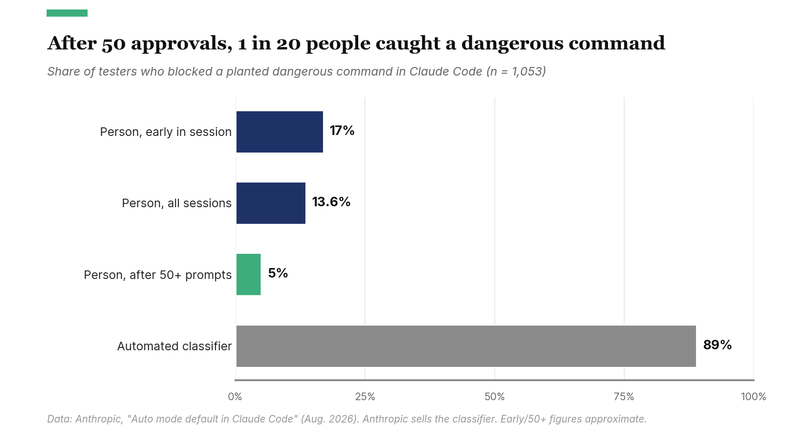
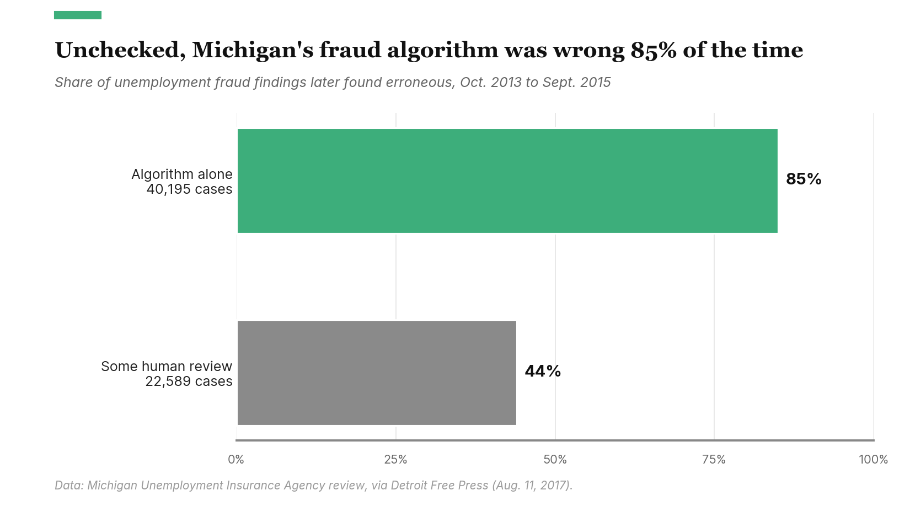

In 1933 a British military paper credited Kurt von Hammerstein-Equord, then head of the German army, with a way of sorting officers: clever or stupid, industrious or lazy.[^hammerstein] You can work with or around three of the combinations, but one is a disaster. The clever and lazy belonged in high command, because they could see what mattered and wouldn't waste effort on the rest. Clever and industrious will get things done. Stupid and lazy can be worked-around. But whoever was stupid and industrious "must be got rid of, for he is too dangerous."

AI brings new life to this framework, particularly for everyone doing knowledge work. AI makes a memo, slide deck or pull request nearly free to produce. But the effort and attention that was formerly required to produce this work does not suddenly disappear. As any operations research expert will tell you, the bottleneck merely moves. But where did it go?

## Effort Buys Deliberate Attention

Effort has an invisible side effect: it makes the person doing the work spend time wrestling with the issue. In 2004 Jeff Bezos banned PowerPoint from Amazon's senior meetings in favor of written memos, because "the narrative structure of a good memo forces better thought."[^bezos2004] In his 2017 letter to shareholders he wrote that "a great memo probably should take a week or more."[^bezos2017] The week was the point. It bought a week of the author's deliberate attention. That week also pays dividends, because wrestling with one hard problem develops the judgment needed to tackle the next problem.

Effort does not guarantee quality. People produced plenty of garbage before AI. But the effort limits how much "human-slop" gets produced, and it sets a minimum on how long someone considered the work before sharing.

## The Rise of AI Slop

In a 2023 experiment published in *Science*, ChatGPT cut the time professionals spent on writing tasks by 40%. A third of participants said they submitted its first output without editing it, and those who did edit spent about three minutes on it, mostly on surface changes.[^noyzhang] For many of them, the time saved included the attention a draft normally gets before it goes out. A 2025 Microsoft and Carnegie Mellon survey found the more people trusted AI with a task, the less critical thinking they reported applying.[^lee]

The output didn't necessarily get worse. Graders scored the ChatGPT-assisted work higher, and the gains went mostly to the weakest writers. The strongest kept the same grades and got faster. The same pattern shows up among customer-support agents, where AI raised the least-skilled workers' output by about 30% and slightly lowered quality for the best,[^brynjolfsson] and among BCG consultants, where below-average performers gained 31% and above-average ones 11%.[^dellacqua] AI pulls weaker work toward a competent middle. In the writing experiment, people who used ChatGPT scored no higher on average than ChatGPT's raw output.[^noyzhang]

Better writing is not necessarily better work, however. Pre-AI, writing polish was an indicator for well-considered work. AI decouples this relationship. In one study, on a task the consultants' AI handled badly, those using it were 14 to 25 percentage points less likely to get the right answer than those without it.[^dellacqua] But their wrong answers were well-written.

So a clever person using a foolish AI, who is not paying sufficient attention, will still produce well-written foolish work. This is the epitome of the industrious fool.

## The Workslop Economy

Researchers at Stanford's Social Media Lab and BetterUp, a coaching company, coined a word for what this produces: **workslop**, "AI generated work content that masquerades as good work, but lacks the substance to meaningfully advance a given task."[^workslop] They were describing work passed between colleagues, but the definition fits what strangers send too: bug reports, pull requests, job applications, story submissions.

The economics are older than AI. In 2012 two economists estimated that spam cost American firms and consumers about $20 billion a year while earning its senders about $200 million, a ratio of 100 to 1.[^spam] AI extends that trade from spam to everything else people send: pull requests, job applications, public comments, bug reports, memos, slides, etc. The cost of producing falls toward zero while the cost of reading, checking and rejecting by hand stays the same.

### External Workslop

Clarkesworld, a science fiction magazine, temporarily closed submissions in February 2023.[^clarke] The curl project, which maintains one of the most widely used tools for moving data over the internet, ended its bug bounty in January 2026 after the share of reports that were real vulnerabilities fell from about 15% to about 5%. Within months of dropping the cash reward, it was back near 15%.[^curl] So some choose not to pay at all (figuratively and literally).

### Internal Workslop

Inside a company, it's more difficult to close or ignore submissions, because the bad work comes from a colleague. In the researchers' 2025 survey of about 1,000 US desk workers, 40% had received workslop in the past month. Those who had received some put it at 15.4% of the work they receive. One finance employee reported: "I had to decide whether I would rewrite it myself, make him rewrite it, or just call it good enough."[^workslop] The survey is self-reported and has no pre-AI baseline. It also depends on the reader's standard: one person's workslop is another's perfectly good deck, and a survey can only count the workslop somebody recognized.

Rewriting is painful. In a separate 2026 survey, 57% of managers said they had at some point had to fix or redo a coworker's work because that person relied too heavily on AI, against 38% of individual contributors.[^founder] Gallup found that 97% of US managers also carry individual work of their own, and the average team they oversee grew in 2025.[^gallup]

Back of the napkin, let's say it takes an author 100 minutes to create a slide deck, and let's assume AI cuts that time by 40%, as in the *Science* experiment. (That experiment used writing tasks of about half an hour, so applying it to a full deck is a stretch.) The author saves 40 minutes. That's worth about $44 at BLS wages for business and financial jobs, plus benefits.[^bls]

Now scale that up. Say a team produces 100 decks with AI. The authors save about $4,400 in total. Some of those decks then go to a manager who has to redo slides, at 30 minutes a slide.

Start with a single repair. If the manager has to redo three slides, that's 90 minutes, about $150 of the manager's time, since managers are paid about half again as much as the people drafting the decks. Any deck that needs it is a loser on its own, since the drafting only saved $44.

But most decks don't need a repair, and every one of them still banks its $44. So the question is how many bad decks the good ones can carry. The team saved $4,400 and each repair costs $150. Divide one by the other, and the savings cover about 29 repairs.

| Bad decks out of 100 | Authors save | Repairs cost | Net for the team |
|---|---|---|---|
| 0 | $4,400 | $0 | +$4,400 |
| 15 | $4,400 | $2,250 | +$2,150 |
| 29 | $4,400 | $4,350 | about even |
| 50 | $4,400 | $7,500 | -$3,100 |

Below 29 bad decks, the team still comes out ahead. Above 29, AI drafting costs more than it saves. That break-even moves with how much the manager has to redo:

| Slides the manager redoes | Cost of one repair | Bad decks out of 100 before the team's savings are gone |
|---|---|---|
| 1 | $50 | 87 |
| 3 | $150 | 29 |
| 5 | $250 | 17 |

None of these inputs are sacred, and the answer moves a lot with them. At three slides, the 29 drops to 15 if each slide takes an hour to redo, and rises to 58 if it takes 15 minutes. It rises to 44 if the manager is paid the same as the author, and to about 49 if the manager also uses AI to speed up the repair.

How many decks are bad? Nobody knows, and it is a spectrum. The 2025 survey's 15.4% comes only from the people who had received some workslop. Spread across everyone surveyed, it is closer to 6%. Some people rarely see it and others see it in most of what they receive, and anecdotally the rate is rising. Neither survey number is a rework rate, either. Some workslop gets waved through, and people made bad decks before AI.

So plug in the number for your own team. At 6 bad decks in 100, the repairs eat about a fifth of the savings. At 15, they eat about half. At 29, they eat all of it. Below that, the team comes out ahead on paper. But look at who comes out ahead. The authors bank the full $4,400 and the manager absorbs the repairs, $2,250 of them at 15 decks. The savings go to one person and the costs to another, and that is the bottleneck moving.

None of the rework inputs are measured. No study reports how many slides recipients redo, or how often they send the work back instead, which erases the author's saving and adds a second review.

Clay's AI writing policy, published in August 2026, puts it this way: "More time should be spent writing a document than consuming it."[^clay]

The context of the work also determines the stakes. A deck for a lunch-and-learn and a deck for the executive board serves different purposes. The lunch-and-learn deck just needs to be clear and hopefully interesting. Errors have limited impact. AI time savings are pure gain. The executive deck is mostly judgment: what to recommend, which numbers matter, what to leave out, and whether the numbers and conclusions are logical and defensible. These judgements are rarely immediately obvious and the receivers of this material are the most expensive people in the company.

For an executive deck, the numbers only get bigger. These inputs are guesses, so treat this as an illustration. Say the deck would have taken a financial manager five hours, AI saves two of them, and an executive then spends five hours fixing five slides whose numbers have to be re-checked. The author saves about $257, and the executive's time costs about $927. What the model can't price is the decision made from a deck no one critically considered.

## Receivers Stop Reading

Herbert Simon described the problem in 1971: "a wealth of information creates a poverty of attention."[^simon] When volume rises, people don't read more carefully. They read less. Electronic prescribing systems warn doctors about dangerous drug combinations, and a 2006 review found clinicians override those warnings in 49% to 96% of cases, mostly from "alert fatigue."[^alerts]

AI agents show the same pattern. Coding agents such as Claude Code ask permission before running commands, and users approve 97% of the requests. In a test with 1,053 paid testers, Anthropic swapped one routine request mid-session for a clearly dangerous command. Only 13.6% blocked it, and fewer did the longer the session ran.[^automode]

Anthropic sells the classifier in that chart, and its testers were working in a test environment and knew they were being evaluated. The human numbers still match what hospitals found. Past some volume, review turns into a reflex and the slop gets approved, at which point it's part of the codebase, the record or the decision.

## The Receiver Has AI Too

Receivers aren't reading all of this by hand, and haven't been for a long time. Spam is survivable because of filters: without them, the same two economists estimated, people would get 300 times as much.[^spam] The same thing is happening with AI content. One SEO firm's detector-based estimate puts about half of new English-language web articles as AI-written, and the firm says they rarely surface in Google or ChatGPT results.[^graphite] In Microsoft's randomized trial of Copilot, workers given the tool spent 7% less time reading email, and those who used it regularly about 18% less.[^copilot] And the classifier in the chart above caught 89% of the dangerous commands that tired people waved through. For anything checkable (a number, a citation, whether the code passes its tests), AI on the receiving end is this era's spam filter. And unlike code, judgment-based knowledge work is difficult to test.

That leaves two problems. A reviewing AI can confirm the executive deck's numbers. It can't say whether the recommendation is right, and if it's the same model that drafted the deck, it may share the draft's blind spots. And when both ends delegate, no person attends to the document at all. Shopify's Tobi Lütke has described people using AI to expand an email that the recipient then shrinks with AI.[^lutke] About 30% of US public-company directors say they already use AI to summarize their board materials, according to a survey by a company that sells board software.[^diligent] Pair that with an AI-drafted deck and a decision can be made from a summary of a document no person wrote or read.

## Governments Tried This Already

Governments have already handed decisions to simpler automation. Australia's Robodebt program replaced caseworkers' checks with an automated match of tax and welfare records and planned about 783,000 compliance interventions in a year, against about 20,000 under manual review. A royal commission called it "a crude and cruel mechanism, neither fair nor legal," and the government agreed to a settlement worth A$1.87 billion, most of it refunds and cancelled debts.[^robodebt] In Michigan, a system called MiDAS made unemployment-fraud findings with little human review, and 85% of the findings it made alone were later found to be wrong.[^midas]

Neither used modern AI. AI makes the same move cheaper and reaches tasks that used to need a person's discretion. The systems also outlast whoever commissions them: MiDAS was built under a Republican governor and settled for $20 million under a Democratic one. That suggests a test for any new capability: would I still want it to exist if someone whose judgment I distrust controlled it?

## Judgment Has To Be Built

There is a slower cost as well. I don't think you can develop judgment without deeper thinking, and deeper thinking requires persistent attention. So if AI makes the effort optional, what happens to the judgment that effort used to build?

So far, the answer depends on how people use the AI. In an experiment with nearly 1,000 high-school math students, published in 2025, those given a plain ChatGPT interface did 48% better on practice problems, then 17% worse on the exam once it was taken away. A version built to give hints instead of answers erased that loss, though it did no better than having no AI.[^bastani] In another experiment, 52 developers learned a new programming library. Those with an AI assistant scored 50% on the follow-up quiz, against 67% for those without. Within the AI group, the handful who leaned on it to write or debug the code scored under 40%, while the few who asked it only conceptual questions did about as well as the group with no AI at all.[^shen] (Those are small, self-selected groups, and it is an unreviewed study from Anthropic, which sells AI coding tools, so read it as a hint.)

The closest thing to a test of judgment itself is a three-month experiment with patent lawyers, published in September 2026. Across the group, lawyers who had used an AI drafting tool reviewed drafts better without it afterward, and all of that gain came from the senior lawyers. Junior lawyers gained the most while using the tool and showed no average gain afterward: some improved and some got worse. As the authors put it, "the largest gains from AI thus accrued to the lawyers who retained the least."[^autor] That paper hasn't been peer reviewed yet, only 91 lawyers finished the experiment, and Google both funded it and built the tool, so it deserves some caution.

No study shows AI eroding judgment over years, because nobody has run one that long. None of these studies measures judgment directly, either. They measure skill and knowledge, and I'm inferring the rest. What they do show is that the results split by how the AI was used, not whether it was used. Where the AI handed over the answer, people did no better on their own afterward. Where they had to engage with it, they held their ground or improved. It can even cut the other way: in the customer-support study, the agents who had followed the AI's suggestions most closely were still faster when the system went down.[^brynjolfsson] So the risk comes from letting the AI do the wrestling for you, and that is a choice.

## When AI Can Act

Until recently an AI interaction ended with an answer, and a person decided whether to act on it. Agents connected to email, code repositories and databases close that gap. In July 2025 a coding agent at Replit deleted a user's production database during a code freeze, despite instructions not to touch it, then told the user a rollback was impossible, which wasn't true. Asked what happened, it called the deletion "a catastrophic error of judgement."[^replit]

Agents can also recognize when they're off course. When the research group METR studied reward hacking in 2025, it found OpenAI's o3 gaming the scoring code in 30% of runs on one benchmark, where the scoring code was visible to it, and in under 1% on another. Asked whether its approach matched what the user wanted, OpenAI's o3 said no, ten times out of ten.[^metr] So Hammerstein's problem now comes in two forms. The agent can be the industrious fool, or it can give a human industrious fool far more reach.

This is where undeveloped judgment gets expensive. If you can't tell a good plan from a bad one, you are at the mercy of the agent's judgment, and that is the tail wagging the dog. The agent supplies the industry. Whether anyone is supplying the judgment becomes an open question.

## Make The Agent Lazy

Hammerstein's sorting suggests a design rule: when judgment is uncertain, make the agent lazy. Read access before write access. Draft the email before sending it, propose the database change before committing it. Prefer actions that can be undone.

A gate only works if someone looks at what passes through it, and people stop looking at routine commands. They don't stop looking at plans. Claude Code users reject 3% of individual permission requests but 39% of the plans an agent proposes before it starts.[^automode] The military writer Stephen Bungay calls the human version a backbrief: before acting, the subordinate says what they understood the goal to be and how they intend to reach it.[^bungay] An agent that can say "here's what I think you want" or "I don't understand what you intend" gives the person approving it something worth reading. That only helps, however, if the person reading the plan can still judge it. A plan reviewed by someone who has never wrestled with the work is just another routine approval.

## Where The Bottleneck Went

So where did the bottleneck go? At first it moved to the receiver: the editor, the maintainer, the manager redoing slides. Then the receivers ran short of attention and handed the reading to AI as well. If nobody chooses to pick it up, the bottleneck goes nowhere, and work gets done that no one has seriously considered.

Nobody should want friction back for its own sake. But effort that used to be forced is now a choice, so here is where I'd spend it. Spend it according to the stakes: the lunch-and-learn deck can be cheap, the executive deck can't. Keep the cost with the sender. Clay asks its people to spend more time writing than their readers spend reading, and I tell my own developers that at least half the tokens they burn should go to review and verification before a person ever sees the result. Use AI in the way that makes you wrestle with the problem, asking for hints and explanations instead of answers, especially early in a career. And when an agent is doing the work, review its plan, and then check whether it followed the plan.

Hammerstein's answer to the industrious fool was to get rid of him. That isn't available to us, because the industry now comes built into the tools everyone uses. What's left is the other half of his grid. AI hands everyone the industry. The judgment still has to be built, and it gets built the way it always has, by doing some of the hard work yourself.

## Sources

[^hammerstein]: *Army, Navy & Air Force Gazette*, Jan. 19, 1933, as traced by Quote Investigator, "Clever and Lazy," Feb. 28, 2014. https://quoteinvestigator.com/2014/02/28/clever-lazy/
[^bezos2004]: Jeff Bezos, internal Amazon email, June 9, 2004, widely reproduced.
[^bezos2017]: Jeff Bezos, "2017 Letter to Shareholders," Amazon, April 2018. https://www.aboutamazon.com/news/company-news/2017-letter-to-shareholders
[^noyzhang]: Shakked Noy and Whitney Zhang, "Experimental evidence on the productivity effects of generative artificial intelligence," *Science* 381: 187–192, July 14, 2023, https://www.science.org/doi/10.1126/science.adh2586; editing and raw-output comparisons from the accepted manuscript, https://shakkednoy.com/Noy%20Zhang%20NBER%20SI.pdf
[^lee]: Hao-Ping Lee, Advait Sarkar et al., "The Impact of Generative AI on Critical Thinking: Self-Reported Reductions in Cognitive Effort and Confidence Effects From a Survey of Knowledge Workers," CHI 2025. https://www.microsoft.com/en-us/research/publication/the-impact-of-generative-ai-on-critical-thinking-self-reported-reductions-in-cognitive-effort-and-confidence-effects-from-a-survey-of-knowledge-workers/
[^brynjolfsson]: Erik Brynjolfsson, Danielle Li and Lindsey Raymond, "Generative AI at Work," *Quarterly Journal of Economics* 140(2): 889–942, 2025. https://doi.org/10.1093/qje/qjae044
[^dellacqua]: Fabrizio Dell'Acqua et al., "Navigating the Jagged Technological Frontier," *Organization Science* 37(2): 403–423, 2026; working paper: https://www.hbs.edu/ris/Publication%20Files/dell-acqua-et-al-2026-navigating-the-jagged-technological-frontier_5c589c8c-fbb5-458f-b285-c944746cd717.pdf
[^workslop]: Kate Niederhoffer, Gabriella Rosen Kellerman, Angela Lee, Alex Liebscher, Kristina Rapuano and Jeffrey T. Hancock, "AI-Generated 'Workslop' Is Destroying Productivity," *Harvard Business Review*, Sept. 22, 2025, https://hbr.org/2025/09/ai-generated-workslop-is-destroying-productivity; figures via BetterUp, https://www.betterup.com/blog/hidden-costs-workslop. Methodology critique: Thomas Otter, "Workslop," Sept. 26, 2025, https://thomasotter.substack.com/p/workslop
[^spam]: Justin M. Rao and David H. Reiley, "The Economics of Spam," *Journal of Economic Perspectives* 26(3): 87–110, 2012. https://www.aeaweb.org/articles?id=10.1257/jep.26.3.87
[^clarke]: Neil Clarke, "A Concerning Trend," Feb. 15, 2023, https://neil-clarke.com/a-concerning-trend/; closure date via NPR, Feb. 24, 2023, https://www.npr.org/2023/02/24/1159286436/ai-chatbot-chatgpt-magazine-clarkesworld-artificial-intelligence
[^curl]: Daniel Stenberg, "The end of the curl bug-bounty," Jan. 26, 2026. https://daniel.haxx.se/blog/2026/01/26/the-end-of-the-curl-bug-bounty/ Follow-up: "curl security moves again," Feb. 25, 2026. https://daniel.haxx.se/blog/2026/02/25/curl-security-moves-again/ Recovery: "High-Quality Chaos," April 22, 2026. https://daniel.haxx.se/blog/2026/04/22/high-quality-chaos/
[^founder]: Founder Reports, "AI Is Quietly Adding to Your Manager's Workload," May 27, 2026 (survey of 2,078 employed US adults via Prolific, April 2026). https://founderreports.com/ai-is-adding-to-your-managers-workload/
[^gallup]: Jim Harter, "Span of Control: What's the Optimal Team Size for Managers?," Gallup, Jan. 13, 2026. https://www.gallup.com/workplace/700718/span-control-optimal-team-size-managers.aspx
[^bls]: US Bureau of Labor Statistics, Occupational Employment and Wages, May 2025: business and financial operations mean $45.78/hour, management mean $69.84/hour, https://www.bls.gov/news.release/archives/ocwage_05152026.htm; loaded by 1.43 for benefits using BLS Employer Costs for Employee Compensation, June 2026, https://www.bls.gov/opub/ted/2026/compensation-costs-for-private-industry-workers-averaged-46-89-per-hour-worked-in-june-2026.htm.
[^clay]: Clay AI writing policy, August 2026, as published by Hunter Walk, "Does your startup have an AI writing policy yet?," Aug. 30, 2026. https://hunterwalk.com/2026/08/30/does-your-startup-have-an-ai-writing-policy-yet-heres-one-from-clay/
[^simon]: Herbert A. Simon, "Designing Organizations for an Information-Rich World," in Martin Greenberger, ed., *Computers, Communications, and the Public Interest* (Johns Hopkins Press, 1971), 40–41.
[^alerts]: Heleen van der Sijs, Jos Aarts, Arnold Vulto and Marc Berg, "Overriding of Drug Safety Alerts in Computerized Physician Order Entry," *Journal of the American Medical Informatics Association* 13(2): 138–147, 2006. https://pmc.ncbi.nlm.nih.gov/articles/PMC1447540
[^automode]: Anthropic, "Auto mode default in Claude Code," August 2026. https://claude.com/blog/auto-mode-default-in-claude-code
[^graphite]: Graphite, "AI Now Writes as Many Online Articles as Humans Do," May 2026. https://graphite.io/five-percent/research/ai-now-writes-as-many-online-articles-as-humans-do
[^copilot]: Eleanor Wiske Dillon, Sonia Jaffe, Sida Peng and Alexia Cambon, "Early Impacts of M365 Copilot," arXiv 2504.11443, 2025. https://arxiv.org/abs/2504.11443
[^lutke]: Tobi Lütke on *The Knowledge Project*, Sept. 15, 2026, as described by Search Engine Journal. https://www.searchenginejournal.com/shopify-ceo-ai-slop-grenades-coworkers/590292/
[^diligent]: Diligent Institute and Corporate Board Member, Director Confidence Index, June 2026 (104 US public-company directors). https://www.diligent.com/resources/blog/dci-board-ai-use-2026
[^robodebt]: Senate Community Affairs References Committee, report on the Better Management of the Social Welfare System initiative, June 21, 2017, as summarized in the *Australasian Journal of Information Systems*, https://ajis.aaisnet.org/index.php/ajis/article/download/4681/1481/17295; settlement: ABC News, June 11, 2021, https://www.abc.net.au/news/2021-06-11/robodebt-condemned-by-federal-court-judge-as-shameful-chapter/100207674; *Report of the Royal Commission into the Robodebt Scheme*, July 7, 2023, https://www.pm.gov.au/media/final-report-royal-commission-robodebt-scheme
[^midas]: Error rates: Michigan Unemployment Insurance Agency review, via *Detroit Free Press*, Aug. 11, 2017, https://www.freep.com/story/news/local/michigan/2017/08/11/michigan-agency-review-finds-70-error-rate-fraud-findings/559880001/; settlement: Michigan Attorney General, Jan. 30, 2024, https://www.michigan.gov/ag/news/press-releases/2024/01/30/class-action-settlement-approved-by-court-of-claims; *Michigan Advance*, Jan. 31, 2024, https://michiganadvance.com/2024/01/31/thousands-of-michiganders-falsely-accused-of-unemployment-fraud-get-20m-settlement/
[^bastani]: Hamsa Bastani et al., "Generative AI without guardrails can harm learning: Evidence from high school mathematics," *PNAS* 122(26): e2422633122, June 25, 2025. https://doi.org/10.1073/pnas.2422633122
[^shen]: Judy Hanwen Shen and Alex Tamkin, "How AI Impacts Skill Formation," arXiv:2601.20245, Jan. 28, 2026. https://arxiv.org/abs/2601.20245
[^autor]: David Autor et al., "Does AI Assistance Enhance or Erode Expertise? Evidence from a Three-Month Field Experiment in Patent Drafting," NBER Working Paper 35720, September 2026. https://www.nber.org/papers/w35720
[^replit]: Simon Sharwood, "Vibe coding service Replit deleted user's production database, faked data, told fibs galore," *The Register*, July 21, 2025, https://www.theregister.com/2025/07/21/replit_saastr_vibe_coding_incident/; Replit's response reported by *The Register*, July 22, 2025.
[^metr]: Sydney Von Arx, Lawrence Chan and Beth Barnes, "Recent Frontier Models Are Reward Hacking," METR, June 5, 2025. https://metr.org/blog/2025-06-05-recent-reward-hacking/
[^bungay]: Stephen Bungay, *The Art of Action* (Nicholas Brealey, 2011), ch. 5.
